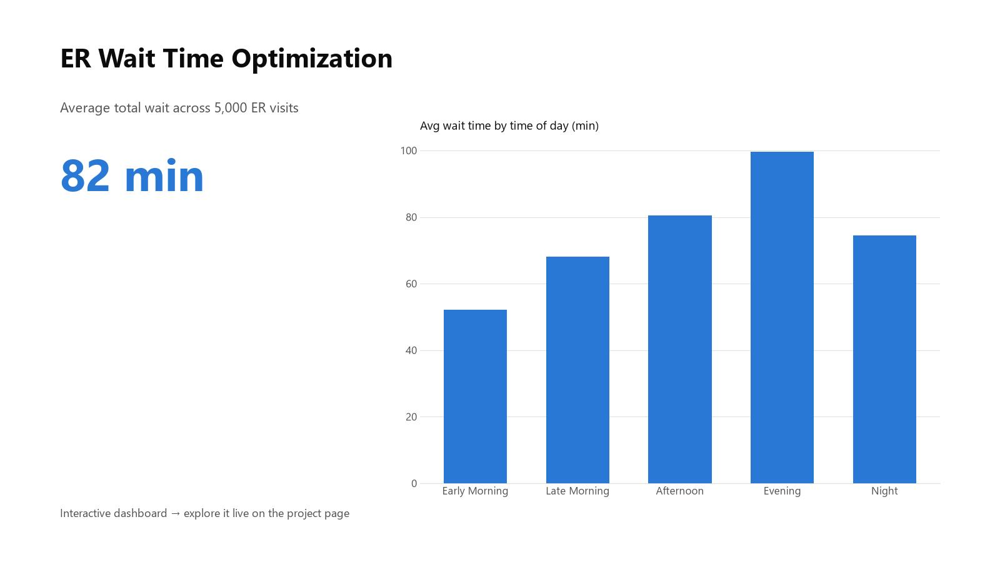

# ER Wait Time Optimization

This project analyzes emergency room wait times to identify throughput bottlenecks and staffing review opportunities. I cleaned and analyzed the data in Excel, and the findings are presented as a **live interactive dashboard** — filter by season and region, and hover over any chart to explore.

**▶ [Explore the live dashboard](https://anthonycid-data-insights.lovable.app/project/er-wait-time-optimization)**

## Contents
- `data/`: cleaned wait time dataset
- `images/`: dashboard preview
- `data_dictionary.md`: source note and field definitions

**Tools Used:** Excel, interactive web dashboard
**Skills Demonstrated:** Data cleaning, pivot tables, interactive dashboard design

## Key Findings
- The dataset contains 5,000 ER visits across five hospitals.
- Monday had the highest average total wait time at 101.6 minutes.
- Evening visits averaged 99.7 minutes, the highest time-of-day segment.
- Low-urgency patients waited 173.5 minutes on average, suggesting a useful dashboard view for lower-acuity flow improvement.
- Higher nurse-to-patient ratio values were associated with longer waits in this sample; ratio 5 averaged 172.1 minutes versus ratio 1 at 16.1 minutes.

## Key Features
- Avg. wait times by urgency level and weekday
- Time-of-day analysis
- Filters for region and season

## My Role
As an ER registrar, I used real-world experience to validate the impact of staffing ratios on patient throughput and satisfaction.
