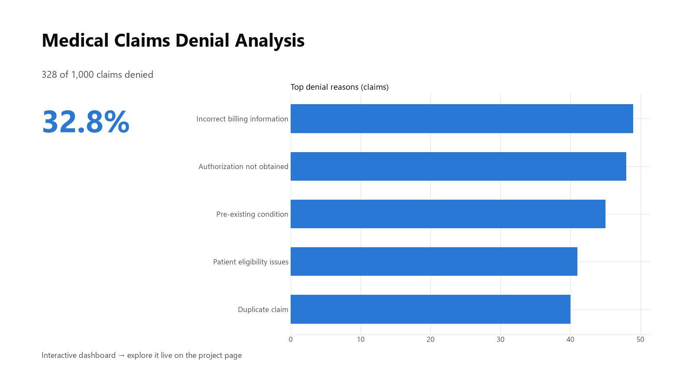

# Medical Claims Denial Analysis

This project highlights trends in medical claims denials across payers, procedures, denial reasons, and follow-up status. It was designed to support denial prevention, revenue cycle visibility, and front-end data quality conversations. The findings are presented as a **live interactive dashboard** — filter by insurance type and follow-up status to explore.

**▶ [Explore the live dashboard](https://anthonycid-data-insights.lovable.app/project/medical-claims-denial-analysis)**

## Contents
- `data/`: cleaned claims dataset
- `images/`: dashboard preview
- `data_dictionary.md`: source note and field definitions

**Tools Used:** Excel, SQL, interactive web dashboard
**Skills Demonstrated:** Data transformation, KPI reporting, SQL joins

## Key Findings
- The dataset contains 1,000 claims with 328 claims marked denied.
- Denied dollars totaled $32,138 in the sample.
- Authorization not obtained was the most common reason code overall, appearing on 154 claims.
- Commercial and Self-Pay claims had the highest denied-dollar totals in this sample, at $8,672 and $8,259 respectively.
- 522 claims required follow-up, giving the dashboard a practical queue-management use case.

## Key Features
- Top denial reasons and affected procedure codes
- Denial rates by insurance type
- Financial impact analysis

## My Role
As an Insurance Specialist, I connected this analysis to front-end data quality and payer workflows, showing how upstream registration, authorization, and billing issues affect downstream revenue.
