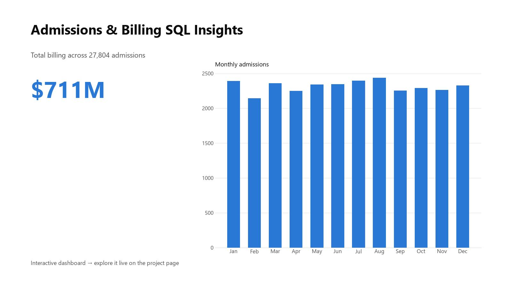

# Patient Admissions & Billing SQL Insights

This SQL-based project explores patterns in patient admissions, condition mix, payer mix, and billing. The goal was to surface operational KPIs that can support planning, payer analysis, and care coordination conversations. The findings are presented as a **live interactive dashboard** — filter by gender, admission type, and insurance provider to explore.

**▶ [Explore the live dashboard](https://anthonycid-data-insights.lovable.app/project/patient-admission-readmission-insights)**

## Contents
- `data/`: cleaned admissions dataset
- `sql/`: query scripts used for analysis
- `images/`: dashboard preview
- `data_dictionary.md`: source note and field definitions

**Tools Used:** SQL, interactive web dashboard
**Skills Demonstrated:** SQL queries, data aggregation, calculated fields

## Key Findings
- The populated admission records include 27,804 usable rows after excluding blank spacer rows.
- Total billing across populated records was approximately $711.0M.
- Blue Cross represented the highest payer billing total at approximately $145.3M.
- Diabetes was the most common populated condition with 4,757 cases.
- Elective admissions had the highest total billing by admission type at approximately $241.6M.

## Key Features
- Case counts by condition and demographics
- Admission counts by month
- Avg. billing by admission type and medical condition
- Billing totals by insurance provider

## My Role
I used SQL to surface operational KPIs and translated them into dashboard visuals that can support hospital decision-making.
