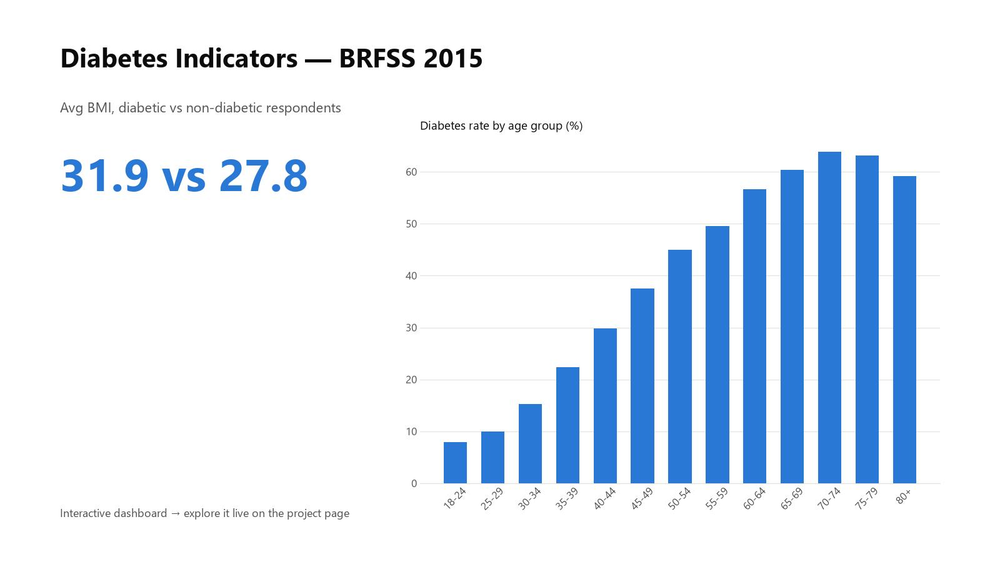

# Diabetes Indicators & Physical Activity Analysis

This project connects physical activity levels to diabetes indicators using a cleaned BRFSS 2015 survey dataset. Inspired by my academic research interests, the goal was to highlight preventable health risks and communicate population health patterns clearly. The findings are presented as a **live interactive dashboard** — filter by gender, smoking, and activity to explore.

**▶ [Explore the live dashboard](https://anthonycid-data-insights.lovable.app/project/diabetes-indicators-physical-activity)**

## Contents
- `data/`: cleaned BRFSS dataset
- `sql/`: query scripts exploring diabetes indicators
- `images/`: dashboard preview
- `data_dictionary.md`: source note and field definitions

**Tools Used:** BigQuery SQL, interactive web dashboard
**Skills Demonstrated:** CTEs, CASE logic, demographic analysis

## Key Findings
- The cleaned dataset contains 70,692 BRFSS survey records.
- Diabetes prevalence was 62.2% among respondents reporting no physical activity versus 44.8% among physically active respondents.
- Respondents with high blood pressure had a diabetes prevalence of 66.8% versus 28.3% for respondents without high blood pressure.
- Respondents reporting difficulty walking had a diabetes prevalence of 73.4%, suggesting an important mobility and chronic disease intersection.
- Diabetes prevalence increased across age bands, peaking at 63.9% in age group 11 within this cleaned sample.

## Key Features
- Diabetes prevalence by activity level
- Insights filtered by age, sex, and smoking
- Custom groupings for cleaner visuals

## My Role
I wrote SQL queries to analyze behavioral data, then presented the key findings in a dashboard for healthcare decision-makers.
