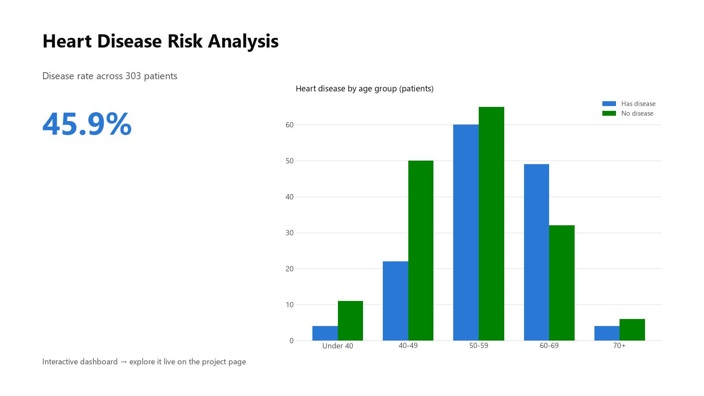

# Heart Disease Risk Analysis

This end-to-end project uses R and Excel to explore patient risk factors for heart disease. It features statistical charts, a cleaned dataset, and a **live interactive dashboard** summarizing clinical patterns — filter by gender and age group to explore.

**▶ [Explore the live dashboard](https://anthonycid-data-insights.lovable.app/project/heart-disease-risk-analysis)**

## Contents
- `data/`: cleaned heart disease dataset
- `notebooks/`: R analysis notebook saved as `.ipynb`, plus a companion `.R` script for easier review
- `images/`: dashboard preview
- `data_dictionary.md`: source note and field definitions

**Tools Used:** R (readr, dplyr, ggplot2), Excel, interactive web dashboard
**Skills Demonstrated:** Data wrangling, statistical visualization, multi-tool integration

## Notebook Note
`heart_disease_risk_analysis_notebook.ipynb` is a Jupyter notebook that uses an **R kernel**, not Python. To make the analysis easier for technical reviewers to inspect, the main R workflow is also available as `notebooks/heart_disease_risk_analysis.R`.

## Key Findings
- The dataset contains 303 patient records.
- 139 records, or 45.9% of the sample, are flagged for heart disease.
- Patients with heart disease had a lower average maximum heart rate (139.3) than patients without heart disease (158.4).
- Exercise-induced angina was associated with a higher heart disease rate in this sample: 76.8% versus 30.9% among those without exercise-induced angina.
- Average oldpeak was higher among patients with heart disease (1.57) than patients without heart disease (0.59).

## Key Features
- Age and cholesterol distributions
- Heart disease rates by gender and chest pain type
- Interactive filters and grouped visuals

## My Role
I developed a full data pipeline and created my first visualizations in R, then brought the clinical patterns into an interactive dashboard for clean presentation.
